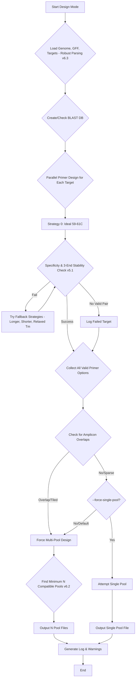

# Multiplex PCR Primer Designer (v6.3)

This is a powerful, fully-automated command-line tool for designing robust, multiplex-ready PCR primer panels for amplicon-based next-generation sequencing.

It is an end-to-end solution that takes a genome, a list of gene targets, and produces a final, validated, and sequencing-ready primer list. It features an advanced **3'-end stability checker** to eliminate false-positive clashes, a **robust GFF parser** to find genes, and an **intelligent auto-pooling engine** to create the minimum number of compatible pools.

## Core Features

* **Intelligent 3'-End Stability Logic (v5.1):** Replaces "dumb" dimer/hairpin checks. It *only* flags biochemically problematic 3'-extendable interactions, dramatically reducing false positives and enabling larger, more efficient pools.

* **Robust GFF Parsing (v6.3):** The GFF parser now robustly searches for gene identifiers under `Name=`, `gene=`, and `locus_tag=` attributes, maximizing target-finding success.

* **Advanced Auto-Pooling (v4.3):** Automatically detects if amplicons are "sparse" or "tiled" (overlapping). For tiled designs, or by default, it finds the *minimum number of compatible pools* (N-pools) required to achieve a perfect, 0-clash design.

* **Multi-Copy Gene Support (v6.0):** Use the `--force-multiprime` flag to design primers for multi-copy genes (like 16S rRNA) where a single BLAST hit isn't expected or desired.

* **Configurable Auto-Healer (v6.2):** The `find_compatible_set` algorithm iteratively swaps primers to resolve clashes. The number of attempts is configurable via `--max-compatibility-iterations`.

* **Smart Retry Logic (v6.2):** The script first attempts to design primers using a strict, "ideal" set of parameters (e.g., "tight at 60C"). If it fails, it automatically retries with a list of more relaxed fallback strategies.

* **Parallel Processing:** Uses all available CPU cores to design primers for large panels quickly.

* **Tail-Only Mode:** A utility to bypass all design logic and simply add adapter tails to a pre-existing primer list.

* **Comprehensive Output:** Generates a `.csv` for ordering, a `.bed` for IGV visualization, and a `.log.txt` for traceability.

## Files in This Repository

* `design_v6.3.py`: The main, executable Python script.

* `requirements.txt`: A list of all required Python libraries.

* `.gitignore`: A list of files (like results and BLAST databases) to ignore in version control.

* `README.md`: This file.

## Installation

**1. Clone the Repository**

```
git clone https://github.com/AHumanBrain/primer_designer.git
cd primer_designer
```

**2. Install Python Dependencies**
This tool requires `biopython`, `primer3-py`, and `tqdm`.

```
pip install -r requirements.txt
```

**3. Install NCBI BLAST+**
This tool requires the `makeblastdb` and `blastn` command-line tools.

* **Download:** [NCBI BLAST+ Download Page](https://ftp.ncbi.nlm.nih.gov/blast/executables/blast+/LATEST/)

* **Install:** Run the installer. **Crucially, ensure you check the box "Add BLAST+ to the system PATH."**

* **Verify:** Open a *new* terminal/PowerShell and type `blastn -version`. You should see a version number.

## Workflow Logic (v6.3)

The script's automated decision-making follows this path:



## Usage

The script operates in two main modes, which it selects based on the arguments you provide.

### Mode 1: Full Design Pipeline

This is the main, fully-automated mode. It designs, validates, and tails primers from scratch.

**Required Arguments:**

* `--genome`: Path to your reference genome (FASTA format).

* `--gff`: Path to your gene annotation file (GFF format).

* `--target-file`: Path to a simple `.txt` file with one gene ID per line.

* `--blast-db`: A prefix for your BLAST database (e.g., "ecoli_db"). The script will automatically build this database from your genome if it doesn't exist.

**Optional Arguments:**

* `--output-prefix`: (Default: `final_primers`) A prefix for your output files.

* `--force-single-pool`: Forces the script to find the "best-available" set for a single tube. *Only used for sparse (non-overlapping) designs.*

* `--force-multiprime`: (v6.0) Allows primers that hit multiple locations (e.g., 16S rRNA). Default is strict single-hit specificity.

* `--max-compatibility-iterations`: (v6.0) Maximum iterations for the auto-healing algorithm. (Default: 100).

#### Example 1: Standard Run (Housekeeping Genes)

This is the recommended command. It will use the "tight at 60C" ideal settings and find the minimum number of perfect pools.

```
python .\design_v6.3.py --genome "ecoli_genome.fna" --gff "genomic.gff" --target-file "target_genes_housekeeping.txt" --blast-db "ecoli_db" --output-prefix "housekeeping_panel"

```

#### Example 2: Advanced Run (16S rRNA genes)

This command designs for multi-copy genes (`--force-multiprime`) and forces them into a single (possibly imperfect) pool.

```
python .\design_v6.3.py --genome "ecoli_genome.fna" --gff "genomic.gff" --target-file "target_genes_16s.txt" --blast-db "ecoli_db" --force-multiprime --force-single-pool --output-prefix "16S_panel"

```

### Mode 2: Tail-Only Utility

This mode bypasses all design and validation. It simply takes existing primer lists and adds your hardcoded sequencing tails.

**Example Command:**

```
python .\design_v6.3.py --tail-fwd-file "my_fwd_primers.txt" --tail-rev-file "my_rev_primers.txt" --output-prefix "my_tailed_primers"

```

## Understanding the Output

The script generates three files for each design or pool:

**1. The `.csv` File (The "Order Sheet")**
This is your main result file. Key columns include:

* **`target_id`**: The gene symbol for this primer pair.

* **`pair_rank`**: The Primer3 quality score (e.g., `0 (Strategy 0 (Ideal))` is the best primer from the "tight at 60C" strategy).

* **`flags`**: **(IMPORTANT)** `Low_Tm` or `High_Tm` if the primer's Tm is outside the `IDEAL_TM_MIN/MAX` range. `Multi_Hit...` if `--force-multiprime` was used and the primer hit >1 location. `OK` means it passed all ideal checks.

* **`fwd_primer_seq` / `rev_primer_seq`**: The 20-mer target-specific sequence.

* **`fwd_primer_tailed` / `rev_primer_tailed`**: The final, 50mer+ sequence (reverse-complemented and tailed), ready to be ordered.

* **`fwd_primer_tm` / `rev_primer_tm`**: The $T_m$ of the *target-specific* sequence.

* **`specificity_hits`**: The BLAST result. `F:1, R:1` is the ideal (unless using `--force-multiprime`).

**2. The `.bed` File (The "Visual Check")**

* A standard genomics file. Load your reference genome (`.fna`) into a genome browser (like **IGV**), then load this `.bed` file to visually confirm your amplicons are in the correct locations.

**3. The `.log.txt` File (The "Traceability Log")**

* Contains a full record of the design process.

* Lists all targets that failed the initial design (e.g., "not found in GFF" or "Could not find a specific, non-hairpin primer pair...").

* Lists any final compatibility warnings if you used `--force-single-pool` and a perfect 0-clash set wasn't possible.

## Design Constants & Customization

The following constants at the top of the script are the primary way to fine-tune the design logic.

```
# --- Hardcoded Adapter Tails ---
FWD_TAIL = 'AGATCGGAAGAGCGTCGTGTAGGGAAAGAGTGT'
REV_TAIL = 'AGATCGGAAGAGCACACGTCTGAACTCCAGTCAC'

# --- Design Constants ---
# (v6.2) TIGHT AT 60C for housekeeping genes
END_STABILITY_DG_THRESHOLD = -9.0  # (kcal/mol) Max allowed 3' end interaction strength. More negative is worse.
IDEAL_TM_MIN = 59.0                # Minimum Tm for 'OK' flag; ALSO used as PRIMER_MIN_TM for Strategy 0
IDEAL_TM_MAX = 61.0                # Maximum Tm for 'OK' flag; ALSO used as PRIMER_MAX_TM for Strategy 0

# --- (v6.2) Constants for Large-Panel Logic ---
MAX_CLASH_RECOMMENDATION = 5       # Warn user if single-pool clashes exceed this
MAX_COMPATIBILITY_ITERATIONS = 100 # Default max iterations for the auto-healing algorithm. Can be overridden by args.
```

**Understanding TM Settings:**

* **`IDEAL_TM_MIN` / `IDEAL_TM_MAX` (e.g., 59.0-61.0):** These serve a dual purpose:

  1. They set the **strict boundaries for Strategy 0**, the "ideal" design.

  2. They act as the **flagging threshold**. Any primer designed by a *fallback strategy* (e.g., with a Tm of 57°C) will receive a `Low_Tm` flag in the final CSV.

* **`PRIMER_OPT_TM` (inside `design_primers_for_sequence`):** This is set to `60.0`. This is the exact $T_m$ Primer3 will try to achieve during Strategy 0.

* **`strategies` list (inside `process_single_target`):** This list defines the *fallback* parameters (e.g., `PRIMER_MIN_TM: 55.0`, `PRIMER_MAX_TM: 65.0`) that are automatically tried if Strategy 0 fails.
