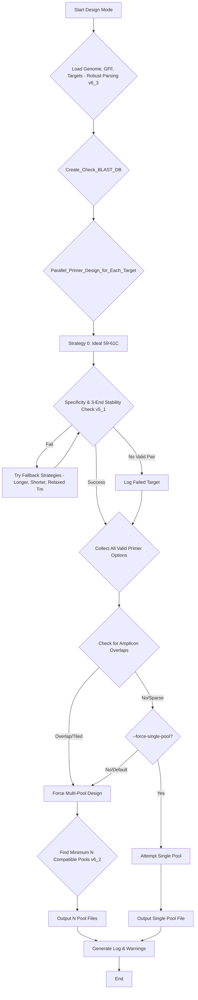

# Multiplex PCR Primer Designer (v7.7)

This is a powerful, fully-automated command-line tool for designing robust, multiplex-ready PCR primer panels for amplicon-based next-generation sequencing.

It is an end-to-end solution that takes a genome, a list of gene targets, and produces a final, validated, and sequencing-ready primer list. It features an advanced **3'-end stability checker** to eliminate false-positive clashes, a **robust GFF parser** to find genes, an **intelligent auto-pooling engine**, and a novel **iterative clamp-design feature** for self-folding hairpin primers.

## Core Features

* **Advanced Oligo Formatting (v7.0):** Toggle output between "template" (`rc_tailed`) and "synthesis-ready" (`fwd_tailed`) formats.
* **Iterative Hairpin Clamping (v7.0):** (Optional) When in "synthesis-ready" mode, iteratively adds a 5' clamp to create a self-folding hairpin primer, calibrated to a specific stem stability ($\Delta G$).
* **Intelligent 3'-End Stability Logic (v5.1):** Replaces "dumb" dimer/hairpin checks. It *only* flags biochemically problematic 3'-extendable interactions, dramatically reducing false positives and enabling larger, more efficient pools.
* **Robust GFF Parsing (v6.3):** The GFF parser now robustly searches for gene identifiers under `Name=`, `gene=`, and `locus_tag=` attributes, maximizing target-finding success.
* **Advanced Auto-Pooling (v4.3):** Automatically detects if amplicons are "sparse" or "tiled" (overlapping). For tiled designs, or by default, it finds the *minimum number of compatible pools* (N-pools) required to achieve a perfect, 0-clash design.
* **Multi-Copy Gene Support (v6.0):** Use the `--force-multiprime` flag to design primers for multi-copy genes (like 16S rRNA) where a single BLAST hit isn't expected or desired.
* **Configurable Auto-Healer (v6.2):** The `find_compatible_set` algorithm iteratively swaps primers to resolve clashes. The number of attempts is configurable via `--max-compatibility-iterations`.
* **Smart Retry Logic (v6.2):** The script first attempts to design primers using a strict, "ideal" set of parameters (e.g., "tight at 60C"). If it fails, it automatically retries with a list of more relaxed fallback strategies.
* **Parallel Processing:** Uses all available CPU cores to design primers for large panels quickly.
* **Tail-Only Mode:** A utility to bypass all design logic and simply add adapter tails to a pre-existing primer list, respecting the chosen `--oligo-format`.
* **Comprehensive Output:** Generates a `.csv` for ordering, a `.bed` for IGV visualization, and a `.log.txt` for traceability.

## Files in This Repository

* `design_v7.7.py`: The main, executable Python script.
* `requirements.txt`: A list of all required Python libraries.
* `.gitignore`: A list of files (like results and BLAST databases) to ignore in version control.
* `README.md`: This file.

## Installation

**1. Clone the Repository**
```bash
git clone [https://github.com/AHumanBrain/primer_designer.git](https://github.com/AHumanBrain/primer_designer.git)
cd primer_designer
```

**2. Install Python Dependencies**
This tool requires `biopython`, `primer3-py`, and `tqdm`.
```bash
pip install -r requirements.txt
```

**3. Install NCBI BLAST+**
This tool requires the `makeblastdb` and `blastn` command-line tools.
* **Download:** [NCBI BLAST+ Download Page](https://ftp.ncbi.nlm.nih.gov/blast/executables/blast+/LATEST/)
* **Install:** Run the installer. **Crucially, ensure you check the box "Add BLAST+ to the system PATH."**
* **Verify:** Open a *new* terminal/PowerShell and type `blastn -version`. You should see a version number.

---

## Workflow Logic (v7.7)

The script's automated decision-making follows this path. The (optional) hairpin clamp logic is a post-processing step applied to primers that pass the `E` check.



---

## Usage

The script operates in two main modes, which it selects based on the arguments you provide.

### Mode 1: Full Design Pipeline

This is the main, fully-automated mode. It designs, validates, and tails primers from scratch.

**Required Arguments:**
* `--genome`: Path to your reference genome (FASTA format).
* `--gff`: Path to your gene annotation file (GFF format).
* `--target-file`: Path to a simple `.txt` file with one gene ID per line.
* `--blast-db`: A prefix for your BLAST database (e.g., "ecoli_db"). The script will automatically build this database from your genome if it doesn't exist.

**Optional Arguments:**
* `--output-prefix`: (Default: `final_primers`) A prefix for your output files.
* `--oligo-format [rc_tailed | fwd_tailed]`: (Default: `rc_tailed`).
    * `rc_tailed`: "Template" format. Outputs the reverse-complement of the primer + the long `FWD_RC_P5_TRUNCATED` tail.
    * `fwd_tailed`: "Synthesis-ready" format. Outputs the forward primer + the `FWD_P5_TRUNCATED` tail.
* `--add-hairpin-clamp`: (Default: False) Iteratively adds a 5' clamp to create a self-folding hairpin. **Requires `--oligo-format "fwd_tailed"`.**
* `--force-single-pool`: Forces the script to find the "best-available" set for a single tube. *Only used for sparse (non-overlapping) designs.*
* `--force-multiprime`: (v6.0) Allows primers that hit multiple locations (e.g., 16S rRNA). Default is strict single-hit specificity.
* `--max-compatibility-iterations`: (v6.0) Maximum iterations for the auto-healing algorithm. (Default: 100).

#### Example 1: Standard Run (Template Format)
This command generates the "template" oligos using the default `rc_tailed` format.

```
python .\design_v7.7.py --genome "ecoli_genome.fna" --gff "genomic.gff" --target-file "target_genes.txt" --blast-db "ecoli_db" --output-prefix "my_panel_template"
```

#### Example 2: Hairpin Clamp Run (Synthesis Format)
This command generates the synthesis-ready, self-folding hairpin primers.

```
python .\design_v7.7.py --genome "ecoli_genome.fna" --gff "genomic.gff" --target-file "housekeeping_target_genes.txt" --blast-db "ecoli_db" --output-prefix "housekeeping_hairpins" --oligo-format "fwd_tailed" --add-hairpin-clamp
```

---

### Mode 2: Tail-Only Utility

This mode bypasses all design and validation. It simply takes existing primer lists and adds your hardcoded sequencing tails, respecting the `--oligo-format` flag.

**Example Command (Synthesis-Ready):**
```
python .\design_v7.7.py --tail-fwd-file "my_fwd_primers.txt" --tail-rev-file "my_rev_primers.txt" --output-prefix "my_tailed_primers_synthesis" --oligo-format "fwd_tailed"
```

---

## Understanding the Output

The script generates three files for each design or pool:

**1. The `.csv` File (The "Order Sheet")**
This is your main result file. Key columns include:
* **`target_id`**: The gene symbol for this primer pair.
* **`pair_rank`**: The Primer3 quality score (e.g., `0 (Strategy 0 (Ideal))` is the best primer).
* **`flags`**: **(IMPORTANT)**
    * `OK`: Passed all ideal checks.
    * `Low_Tm` / `High_Tm`: Tm is outside the `IDEAL_TM_MIN/MAX` range (from a fallback strategy).
    * `HairpinClamp`: The `--add-hairpin-clamp` logic was successfully applied.
    * `Multi_Hit...`: `--force-multiprime` was used and the primer hit >1 location.
* **`fwd_primer_tailed` / `rev_primer_tailed`**: The final oligo sequence. Its content depends entirely on the `--oligo-format` and `--add-hairpin-clamp` flags.
* **`fwd_primer_seq` / `rev_primer_seq`**: The 20-mer target-specific sequence, *without* any tails or clamps.
* **`fwd_primer_tm` / `rev_primer_tm`**: The $T_m$ of the *target-specific* sequence.
* **`specificity_hits`**: The BLAST result. `F:1, R:1` is the ideal (unless using `--force-multiprime`).

**2. The `.bed` File (The "Visual Check")**
* Load your reference genome (`.fna`) into a genome browser (like **IGV**), then load this `.bed` file to visually confirm your amplicon locations.

**3. The `.log.txt` File (The "Traceability Log")**
* Contains a full record of the design process.
* Lists all targets that failed the initial design.
* Lists any final compatibility warnings if `--force-single-pool` was used.

## Design Constants & Customization

The following constants at the top of the script are the primary way to fine-tune the design logic.

```python
# --- (v7.7) Refactored Hardcoded Adapter Tails ---
# For 'fwd_tailed' (synthesis-ready) format
FWD_P5_TRUNCATED = 'ACACTCTTTCCCTACACGACGCTCTTCCGATCT'
REV_P7_TRUNCATED = 'GTGACTGGAGTTCAGACGTGTGCTCTTCCGATCT'
# For 'rc_tailed' (template-generation) format
FWD_RC_P5_TRUNCATED = 'AGATCGGAAGAGCGTCGTGTAGGGAAAGAGTGT'
REV_RC_P7_TRUNCATED = 'AGATCGGAAGAGCACACGTCTGAACTCCAGTCAC'


# --- Design Constants ---
END_STABILITY_DG_THRESHOLD = -9.0
IDEAL_TM_MIN = 59.0
IDEAL_TM_MAX = 61.0

# --- Large-Panel Logic ---
MAX_CLASH_RECOMMENDATION = 5
MAX_COMPATIBILITY_ITERATIONS = 100

# --- (v7.7) Constants for Hairpin Clamp Logic ---
# Calibrated value from user tests (v7.6) to match IDT's calculator.
HAIRPIN_STEM_TARGET_DG = -12.5 # (kcal/mol) The target dG for the *stem* interaction
HAIRPIN_CLAMP_MAX_LEN = 15     # Max bases to add

# Primer3 global arguments are set within design_primers_for_sequence.
# These define the initial target parameters for Primer3.
# Important parameters here (refer to Primer3 documentation for full list):
# 'PRIMER_OPT_SIZE': 20,         # Target primer length
# 'PRIMER_MIN_SIZE': 19,         # Minimum primer length
# 'PRIMER_MAX_SIZE': 22,         # Maximum primer length
# 'PRIMER_OPT_TM': 60.0,         # Primer3 actively tries to design primers with this Tm
# 'PRIMER_MIN_GC': 40.0,         # Minimum GC content percentage
# 'PRIMER_MAX_GC': 60.0,         # Maximum GC content percentage
# 'PRIMER_PRODUCT_SIZE_RANGE': [[150, 250]], # Default amplicon size range
# 'PRIMER_NUM_RETURN': 20        # Number of primer pairs Primer3 attempts to return per sequence
```

The `strategies` list, defined within the `process_single_target` function, provides sequential alternative parameter sets for Primer3 to try if the initial attempt fails. Modifying these allows you to define a precise retry logic:

```python
# --- Inside process_single_target function ---
    # 1. Define Retry Strategies
    strategies = [
        # Strategy 0: Your primary, tightest attempt, using the IDEAL Tms
        {'PRIMER_PRODUCT_SIZE_RANGE': [[150, 250]], 'PRIMER_MIN_TM': IDEAL_TM_MIN, 'PRIMER_MAX_TM': IDEAL_TM_MAX}, 
        # Strategy 1: Longer product size range, with slightly relaxed Tms from the ideal
        {'PRIMER_PRODUCT_SIZE_RANGE': [[250, 350]], 'PRIMER_MIN_TM': 57.0, 'PRIMER_MAX_TM': 63.0}, 
        # Strategy 2: Shorter product size range, with slightly relaxed Tms from the ideal
        {'PRIMER_PRODUCT_SIZE_RANGE': [[100, 150]], 'PRIMER_MIN_TM': 57.0, 'PRIMER_MAX_TM': 63.0}, 
        # Strategy 3: Default product size, but with the most relaxed Tm range
        {'PRIMER_PRODUCT_SIZE_RANGE': [[150, 250]], 'PRIMER_MIN_TM': 55.0, 'PRIMER_MAX_TM': 65.0}, 
    ]

---

## Understanding TM & Stability Settings

* **`IDEAL_TM_MIN` / `IDEAL_TM_MAX` (e.g., 59.0-61.0):** These serve a dual purpose:
    1.  They set the **strict boundaries for Strategy 0**, the "ideal" design.
    2.  They act as the **flagging threshold**. Any primer designed by a *fallback strategy* (e.g., with a Tm of 57°C) will receive a `Low_Tm` flag in the final CSV.
* **`PRIMER_OPT_TM` (inside `design_primers_for_sequence`):** This is set to **`60.0`**. This is the exact $T_m$ Primer3 will try to achieve during Strategy 0.
* **`END_STABILITY_DG_THRESHOLD`:** This is the *filter* to reject primers. It checks the 3' end of the *specific primer sequence* to prevent 3'-extendable primer-dimers.
* **`HAIRPIN_STEM_TARGET_DG`:** This is the *target* for the iterative clamp builder. It uses `primer3.calc_heterodimer` to model the stem (clamp + 3' end of primer) to achieve this dG. This value (`-12.5`) is calibrated to produce final oligos with a $\Delta G$ of ~-14 kcal/mol in external calculators.
